# Rendi-Porto Architecture & Flow Chart

## 🏗️ Project Architecture Overview


## 🎮 User Journey Flow


## 🧩 Component Architecture


## 🎨 Animation Flow

```mermaid
sequenceDiagram
    participant U as User
    participant P as PortfolioApp
    participant G as GSAP
    participant D as DOM
    
    U->>P: Page Load
    P->>G: Initialize Hero Animations
    G->>D: Animate Title (y: 100 → 0)
    G->>D: Animate Subtitle (y: 50 → 0)
    G->>D: Animate Description (y: 30 → 0)
    G->>D: Animate Buttons (y: 30 → 0)
    G->>D: Animate Avatar (scale: 0 → 1, rotation: 360°)
    G->>D: Start Floating Pieces Animation
    
    U->>P: Scroll to Section
    P->>G: Trigger Scroll Animations
    G->>D: Animate Section Elements
    G->>D: Animate Skill Bars
    G->>D: Animate Timeline Items
    
    U->>P: Form Submit
    P->>D: Validate Form
    P->>D: Show Notification
    P->>D: Reset Form
```



## 📱 Responsive Design Flow


## 🔧 Technical Implementation Flow


## 🎯 Performance Optimization Flow


## 🎮 MCGG Portfolio Content Flow


## 🔄 State Management Flow


## 🎨 Animation Timeline

```mermaid
gantt
    title Portfolio Animation Timeline
    dateFormat X
    axisFormat %L ms
    
    section Hero Section
    Title Animation    :0, 1500
    Subtitle Animation :500, 2000
    Description Animation :800, 2300
    Buttons Animation  :1100, 2500
    Avatar Animation   :800, 2800
    Floating Pieces    :800, 3000
    
    section Scroll Animations
    About Cards        :scroll, 1000
    Stats Counters     :scroll, 1200
    Skill Cards        :scroll, 1000
    Skill Bars         :scroll, 2000
    Timeline Items     :scroll, 1000
    Contact Form       :scroll, 1000
    
    section Interactive
    Hover Effects      :active, 300
    Click Animations   :active, 600
    Form Validation    :active, 500
    Notifications      :active, 3000
```

## 📊 Data Flow Architecture


---

## 🚀 Key Features Implementation

### 1. **Responsive Navigation**
- Mobile hamburger menu with smooth transitions
- Desktop horizontal navigation with hover effects
- Smooth scrolling to sections with offset calculation

### 2. **Animation System**
- GSAP-powered animations for performance
- Scroll-triggered animations using Intersection Observer
- Staggered animations for multiple elements
- Interactive hover and click effects

### 3. **Form Handling**
- Real-time validation
- Success/error notifications
- Form reset after submission
- Accessibility features

### 4. **Performance Optimization**
- Lazy loading of animations
- Throttled scroll events
- Optimized asset loading
- Memory management for animations

### 5. **Cross-browser Compatibility**
- Modern CSS with fallbacks
- JavaScript feature detection
- Progressive enhancement
- Mobile-first responsive design

---

*This flowchart represents the complete architecture and user flow of the Rendi-Porto portfolio website, showcasing the technical implementation and user experience design.*